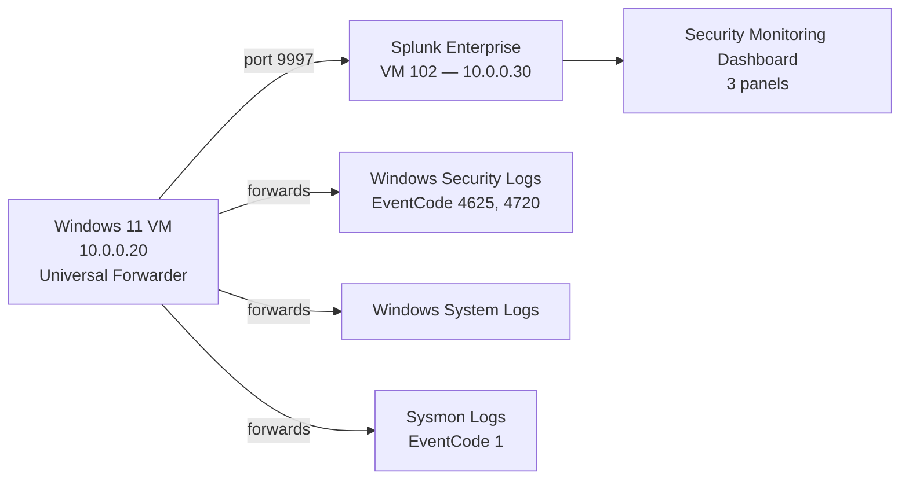
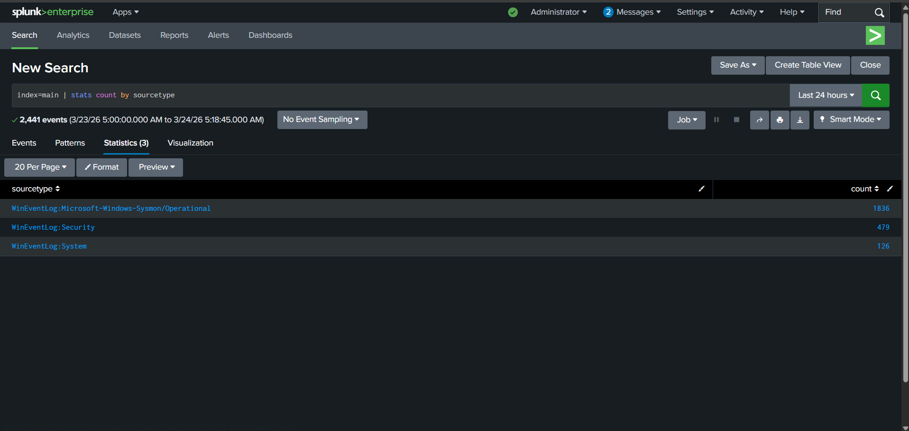
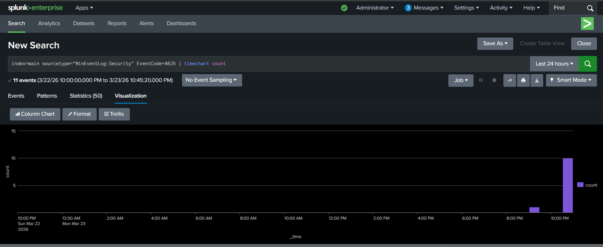
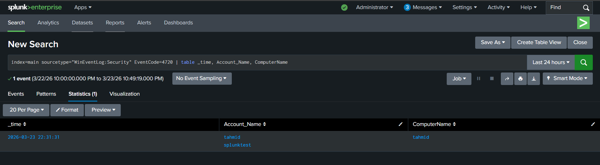
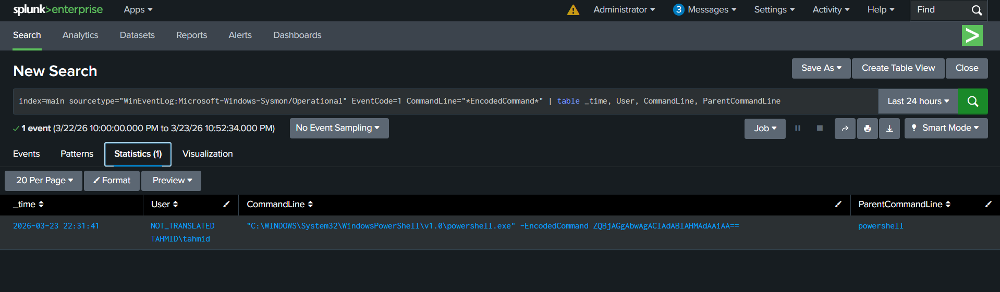
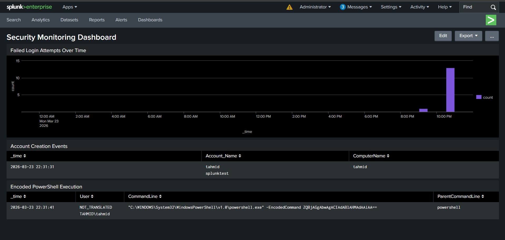

# Splunk SIEM Lab

Splunk Enterprise 9.3.1 deployed on Linux with a Universal Forwarder on a Windows VM, SPL detection queries for three attack types, and a custom security monitoring dashboard.

---

## Architecture



---

## What this is

This is the second SIEM in the lab, deployed alongside Wazuh. The goal was to run the same three attack simulations through a different detection platform and build detections using SPL (Splunk's query language) rather than Wazuh's rule engine.

Running two SIEMs against the same attacks shows how the same event data looks through different lenses — Wazuh correlates automatically using pre-built rules, Splunk requires you to write the queries yourself. Both approaches matter in real environments.

---

## Lab environment

| Component | Details |
|---|---|
| Splunk version | Enterprise 9.3.1 |
| Splunk server | VM 102, 10.0.0.30, 4GB RAM, 2 CPU, 40GB disk |
| Universal Forwarder | VM 103, 10.0.0.20 (same Windows VM as Wazuh agent) |
| Log sources | Windows Security, Windows System, Sysmon |
| Network | Isolated lab — 10.0.0.0/24 behind OPNsense |

---

## What I built

### 1. Splunk Enterprise on Linux

Installed Splunk Enterprise 9.3.1 on the Linux VM. Configured the receiving port (9997) so the Universal Forwarder on the Windows VM knows where to send data. Set up the web interface on port 8000.

### 2. Universal Forwarder on Windows

Installed the Splunk Universal Forwarder on the Windows VM and pointed it at the Splunk server (10.0.0.30:9997). Configured three inputs:
- Windows Security event log
- Windows System event log
- Sysmon operational log

The Forwarder tails these logs and ships new events to the indexer in near real time.

### 3. SPL detection queries

Wrote three SPL queries to detect the same attacks I simulated through Wazuh. These are the queries, not abstractions:

**Brute force (EventCode 4625):**
```spl
index=windows EventCode=4625
| timechart count by EventCode
```

**Account creation (EventCode 4720):**
```spl
index=windows EventCode=4720
| table _time, EventCode, user, ComputerName
```

**Encoded PowerShell (Sysmon EventCode 1):**
```spl
index=windows source="XmlWinEventLog:Microsoft-Windows-Sysmon/Operational" EventCode=1 CommandLine="*EncodedCommand*"
| table _time, CommandLine, ParentCommandLine, ComputerName
```

### 4. Security Monitoring Dashboard

Built a three-panel dashboard in Splunk using the saved searches above:
- Panel 1: Failed logins over time (timechart)
- Panel 2: New account creation events (table)
- Panel 3: Encoded PowerShell commands (table)

Each panel updates when the underlying data changes. The dashboard gives a single view of the three detection categories without running queries manually each time.

---

## Screenshots

### 1. All three log sources confirmed


SPL query showing event counts by sourcetype. Windows Security, Windows System, and Sysmon are all present in the index. This confirms the Universal Forwarder is shipping all three log sources successfully.

---

### 2. Brute force detection — EventCode 4625 timechart


Timechart of EventCode 4625 (failed logon) during the brute force simulation. The spike shows 21 failed logins in a short window — exactly what was simulated. SPL's `timechart` function visualizes the volume over time, which makes the pattern obvious.

---

### 3. Account creation detection — EventCode 4720


Table output showing EventCode 4720 (user account created) from running `net user hacker`. The table shows the timestamp, event code, username created, and the computer it happened on. One row, zero ambiguity.

---

### 4. Encoded PowerShell — Sysmon EventCode 1


Sysmon EventCode 1 results filtered for `EncodedCommand` in the command line. The full encoded argument is visible in the CommandLine field, along with the parent process. This is the forensic data that makes encoded PowerShell detectable — and it only exists because Sysmon is installed.

---

### 5. Security Monitoring Dashboard — all three panels


The completed three-panel dashboard. Failed login timechart on top, account creation and encoded PowerShell tables below. This is what a basic security operations view looks like in Splunk — multiple detection queries surfaced in one place.

---

## Wazuh vs. Splunk

Both SIEMs detected the same three attacks. The difference is in the approach:

| Aspect | Wazuh | Splunk |
|---|---|---|
| Detection method | Pre-built rule engine (rule IDs) | SPL queries written manually |
| MITRE mapping | Automatic from rule metadata | Manual (would need to tag in query) |
| Compliance mapping | Built-in (PCI DSS, CIS) | Requires additional configuration |
| Query flexibility | Limited to rule conditions | Full SPL — highly flexible |
| Dashboard | Built-in with pre-built visualizations | Custom panels built from SPL |
| Deployment | More complex (manager + indexer + dashboard) | Simpler for single-instance lab |

In a real environment, these aren't competing choices — many orgs run both. Wazuh handles agent-based endpoint detection with automatic compliance mapping; Splunk handles flexible search across any data source. Running both in the lab shows the tradeoffs firsthand.

---

## Skills demonstrated

- Splunk Enterprise deployment and configuration
- Universal Forwarder setup and input configuration
- SPL query writing for security detection
- Multi-source log ingestion (Security, System, Sysmon)
- Dashboard creation for security monitoring
- Cross-platform SIEM comparison (Wazuh vs. Splunk)
- Sysmon integration with Splunk for process-level visibility
